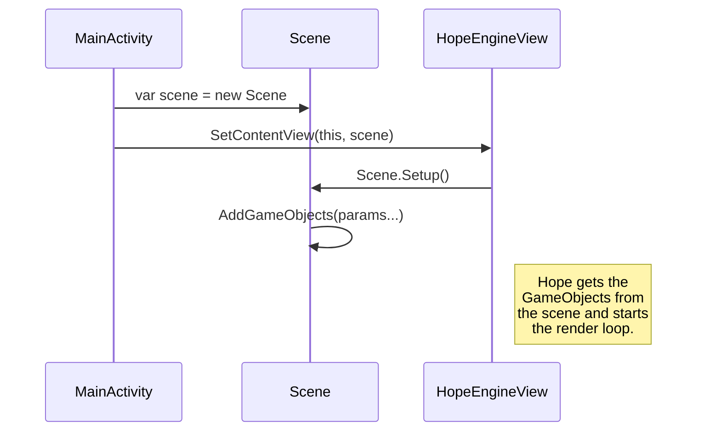

# Hope Engine

Hope Engine (or **Hope**) is a 2D graphics engine made for developing mobile games easly\
Currently Hope supports only Android, there's no iOS support planned currently.

# Architecture
Hope uses a Component-based architecture where any GameObject can be a parent or a child-component.
Anything will be a GameObject, you can add GameObjects to a Scene or GameObjects as childs of other GameObjects.
Hope is able to render one Scene at time, you can easly switch Scenes.

The structure is as follows:

### More to be added...